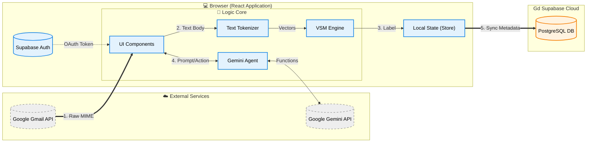
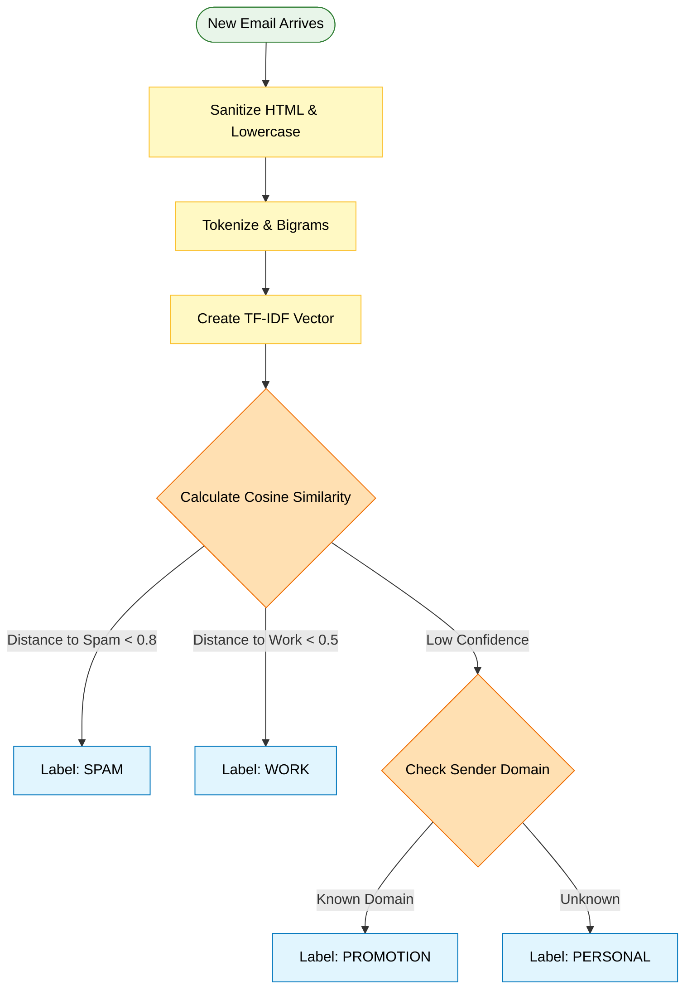
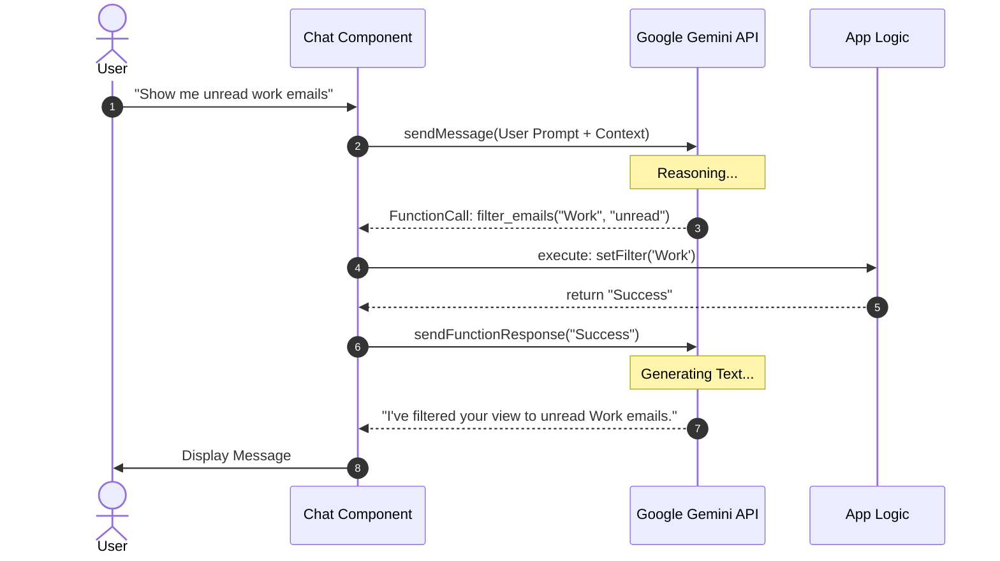

# SecureMail AI - Enterprise Technical Documentation


> **"Secure by Design, Intelligent by Default."**
>
> SecureMail AI is a hybrid-intelligence email client that combines the privacy of **Local Machine Learning** (Vector Space Models) with the reasoning power of **Cloud Generative AI** (Google Gemini).

---

## 📚 Table of Contents

1.  [Executive Summary](#1-executive-summary)
2.  [System Architecture](#2-system-architecture)
    *   [High-Level Diagram](#21-high-level-diagram)
    *   [The Hybrid Intelligence Model](#22-the-hybrid-intelligence-model)
3.  [The Vector Space Model (VSM) Engine](#3-the-vector-space-model-vsm-engine)
    *   [Mathematical Foundation](#31-mathematical-foundation)
    *   [Tokenization Strategy](#32-tokenization-strategy)
    *   [Classification Workflow](#33-classification-workflow)
4.  [Generative AI Integration (Gemini)](#4-generative-ai-integration-gemini)
    *   [Function Calling Architecture](#41-function-calling-architecture)
    *   [Context Injection](#42-context-injection)
5.  [Data Synchronization & Storage](#5-data-synchronization--storage)
    *   [Gmail API Strategy](#51-gmail-api-strategy)
    *   [Supabase Schema & RLS](#52-supabase-schema--rls)
6.  [Project Structure & Codebase](#6-project-structure--codebase)
7.  [Setup & Development Guide](#7-setup--development-guide)
8.  [Model Training Guide](#8-model-training-guide)

---

## 1. Executive Summary

Traditional email clients rely on server-side filtering which compromises privacy. SecureMail AI solves this by moving the classification logic **to the client (browser)**.

**Key Technical Differentiators:**
1.  **Zero-Knowledge Classification:** Email bodies are analyzed in the browser using a pre-trained Vector Space Model. Raw email content is NOT sent to our servers for categorization.
2.  **Deterministic AI:** Unlike LLMs which can hallucinate, the VSM engine provides consistent, mathematical classification (Spam, Phishing, Work, etc.).
3.  **Agentic Workflow:** The embedded Chatbot isn't just a text generator; it is an agent capable of executing UI actions (filtering, opening emails, drafting) via Gemini Function Calling.

---

## 2. System Architecture

### 2.1 High-Level Diagram

The system operates on a **Client-First** architecture. The diagram below illustrates the data flow from ingestion to classification.



### 2.2 The Hybrid Intelligence Model

SecureMail uses two "brains":

| Feature | Brain 1: Local VSM | Brain 2: Cloud LLM (Gemini) |
| :--- | :--- | :--- |
| **Role** | Fast Classification & Security Scanning | Reasoning, Summarization, Chat |
| **Location** | Runs in Browser (Client-side) | Runs in Google Cloud |
| **Latency** | < 10ms (Instant) | ~1-3s (Network) |
| **Privacy** | 100% Private (No data egress) | Data sent only on user request |
| **Input** | Cleaned Text Tokens | Natural Language Prompts |

---

## 3. The Vector Space Model (VSM) Engine

The heart of the privacy engine is located in `src/services/vsmService.ts`.

### 3.1 Mathematical Foundation

The model views emails not as text, but as **vectors in a multi-dimensional space**.
*   **Dimensions:** ~2,000 top words (Features) derived from the training corpus.
*   **Artifacts:** The model relies on `trainedModel.json`.

### 3.2 Classification Logic



### 3.3 Classification Workflow

1.  **Vectorization:**
    *   The email is converted into a vector $V_{email}$.
    *   **Field Weighting:** Tokens found in the **Subject** are multiplied by 5. Tokens in the **Sender Name** are multiplied by 10. Body tokens have a weight of 1.
    *   **TF-IDF:** $W_{t} = TF(t) \times IDF(t)$. This ensures rare, significant words drive the classification.

2.  **Cosine Similarity:**
    *   We calculate the cosine similarity between the email vector $V_{email}$ and every Category Centroid $C_{category}$.
    *   $$ Similarity = \cos(\theta) = \frac{V \cdot C}{\|V\| \|C\|} $$

---

## 4. Generative AI Integration (Gemini)

Located in `src/services/geminiService.ts` and `src/components/Chatbot.tsx`.

### 4.1 Function Calling Architecture

The chatbot is aware of the UI capabilities. We define `tools` in the Gemini configuration:

*   `filter_emails(category)`: Changes the visual list filter.
*   `open_email(id)`: Navigates to a specific email view.
*   `delete_email(id)`: Moves an item to trash.
*   `get_email_full_content(id)`: Fetches body text for summarization.

### 4.2 Interaction Loop



---

## 5. Data Synchronization & Storage

### 5.1 Gmail API Strategy
Located in `src/services/supabase.ts` (function `fetchGmailWithToken`).

*   **Batching:** We fetch emails in batches of 50 to avoid Rate Limits.
*   **Decoupling:**
    1.  First request: `messages.list` (Get IDs).
    2.  Second request: `messages.batchGet` (Get content).

### 5.2 Supabase Schema & RLS

Data is persisted in PostgreSQL for offline access.

**Security Policy:**
```sql
CREATE POLICY "User owns emails" 
ON emails 
FOR ALL 
USING (auth.uid() = user_id);
```
This guarantees that even if the API client is compromised, a user can NEVER access another user's emails.

---

## 6. Project Structure & Codebase

```
/
├── public/                 # Static assets
├── src/
│   ├── components/         # React UI Components
│   │   ├── Chatbot.tsx     # The AI Agent UI & Logic
│   │   ├── EmailList.tsx   # Virtualized List & VSM Integration
│   │   └── ...
│   ├── services/
│   │   ├── vsmService.ts   # THE MATH CORE (Classification)
│   │   ├── geminiService.ts# Cloud AI Interface
│   │   ├── supabase.ts     # DB & Gmail API Adaptor
│   │   └── trainedModel.json # The Knowledge Base
│   ├── types.ts            # TypeScript Definitions
│   ├── App.tsx             # Main Layout & State
│   └── main.tsx            # Entry Point
├── generate-model.js       # Node.js Script for training
├── training-corpus.json    # The "Textbook" for the VSM
└── ...config files
```

---

## 7. Setup & Development Guide

### Prerequisites
*   Node.js v18+
*   Supabase Project (URL & Key)
*   Google Cloud Project (Enabled Gmail API, OAuth Client ID)
*   Google AI Studio Key (Gemini API)

### Step 1: Environment Variables
Create `.env` in the root:
```env
VITE_SUPABASE_URL=https://your-project.supabase.co
VITE_SUPABASE_KEY=your-anon-key
VITE_API_KEY=your-gemini-api-key
```

### Step 2: Database Init
Run the SQL script provided in the "SQL Schema" section of the previous documentation to create tables and policies.

### Step 3: Install & Run
```bash
npm install
npm run dev
```

---

## 8. Model Training Guide

The system comes with a default model. However, for enterprise use cases or different languages, you should retrain it.

1.  **Prepare Data:** Edit `training-corpus.json`.
    *   Format: `[{ "text": "...", "label": "Spam", "subject": "..." }]`
    *   Ensure balanced data (e.g., 50 Spam, 50 Work examples).

2.  **Run Trainer:**
    This script runs in Node.js (not the browser). It calculates the vocabulary, IDF values, and centroids.
    ```bash
    node generate-model.js
    ```

3.  **Hot Reload:**
    The script writes to `src/services/trainedModel.json`. The React app imports this JSON. Vite will automatically HMR (Hot Module Reload) the new logic instantly.

---

## 9. Performance & Limitations

*   **Performance:**
    *   VSM Classification: ~2-5ms per email (Client-side).
    *   Email Sync: ~50 emails / second (bottlenecked by Gmail API).
*   **Limitations:**
    *   **Vocabulary:** Fixed at training time. New slang/words won't be weighed correctly until retraining.
    *   **Context:** VSM treats words as a "bag of words" (mostly). It doesn't understand deep semantics like LLMs, but it is much faster and cheaper for labeling.

---

**© 2024 SecureMail AI Project. Open Source Software.**
